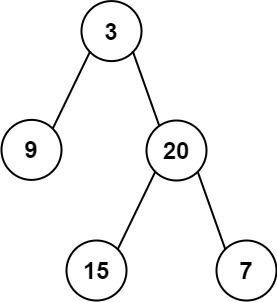

# 题目描述
输入某二叉树的前序遍历和中序遍历的结果，请构建该二叉树并返回其根节点。

假设输入的前序遍历和中序遍历的结果中都不含重复的数字。

## 示例1：

```
Input: preorder = [3,9,20,15,7], inorder = [9,3,15,20,7]
Output: [3,9,20,null,null,15,7]
```

## 示例2：
```
Input: preorder = [-1], inorder = [-1]
Output: [-1]
```

## 限制：
0 <= 节点个数 <= 5000